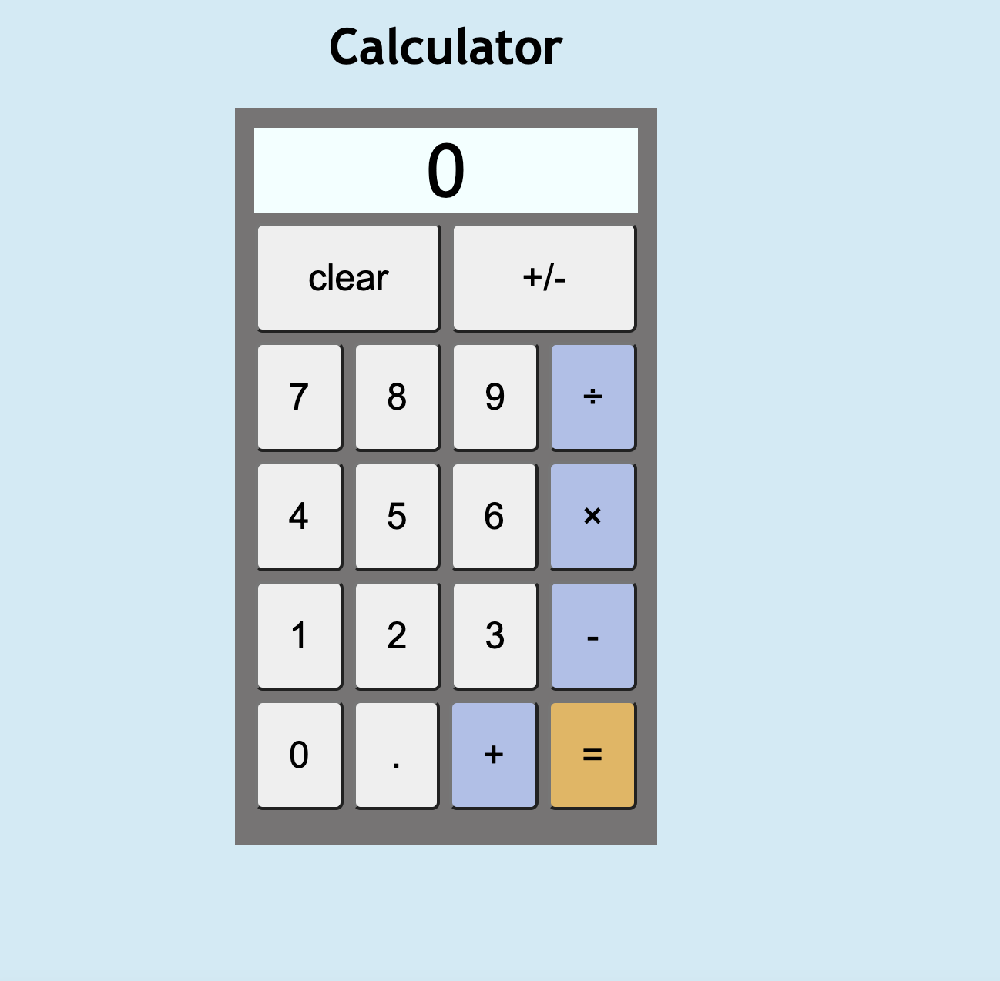

# calculator
Calculator built with HTML, CSS, and Javascript. The Odin Challenge Project

Live Site: [Calculator](https://kaykaym01.github.io/calculator/)

The Odin Project: [Calculator Challenge](https://www.theodinproject.com/lessons/foundations-calculator)

Site Screenshot:

Features:
* Similar functionality to iOS calculator in standard mode
* Calculator does operations in order 
* Includes standard operators (*, /, +, -) as well as a sign button (+/-), and decimal button (.)
* Also accepts keyboard input

Developed using HTML/CSS/JavaScript